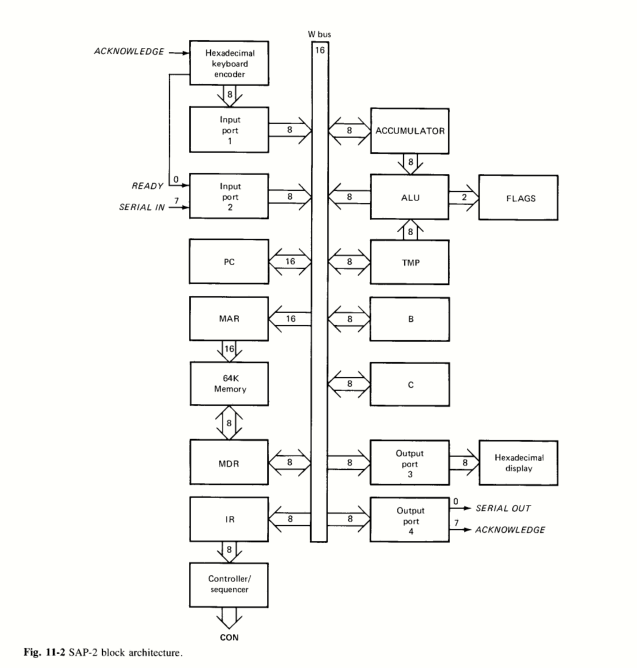
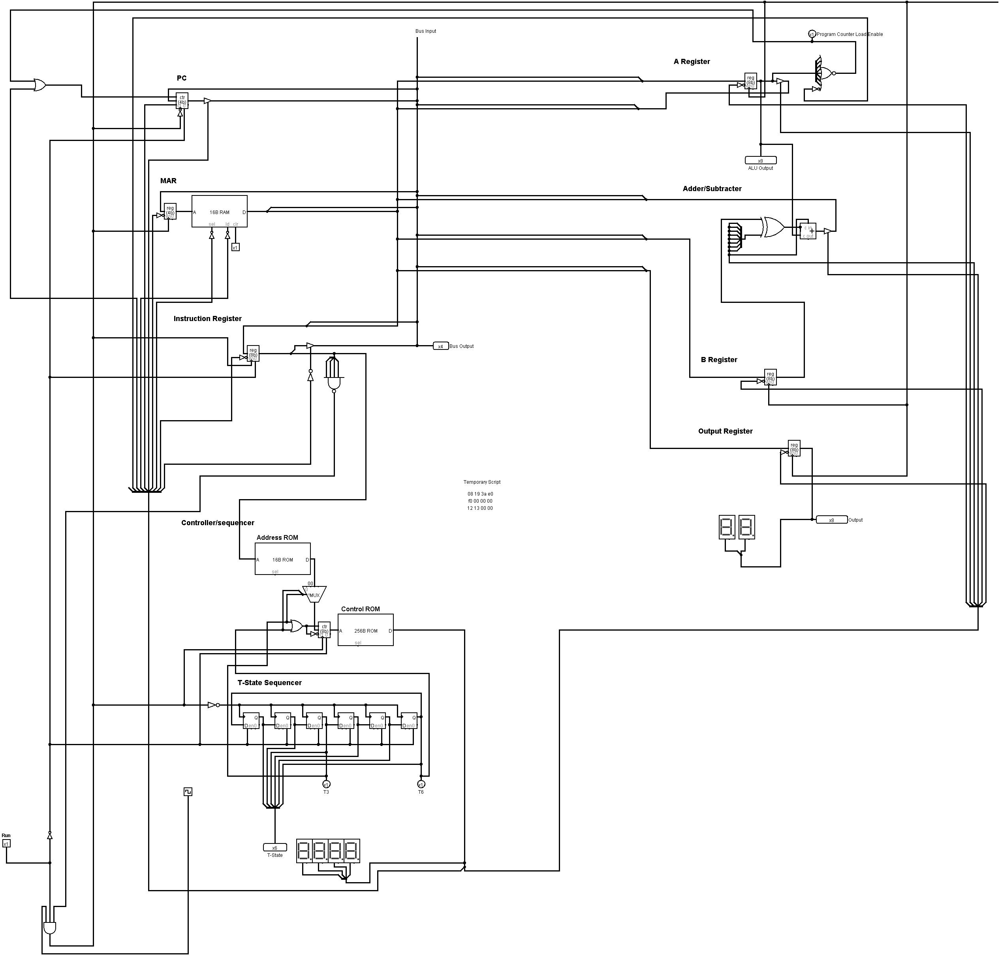

# Sap-2
> Modified Computer Architecture SAP-2 by Malvino

I've only added Jump, Jump If 0, Store, and Load Indirect in this version of SAP-2, apart from its primary SAP-1 feature. It also inherits the SAP-1 T-states, which has a maximum condition of 6.

## Malvino Layout

### Version 1 (March. 29, 2020)

The table underneath shows the SAP-2 instruction set.
### SAP-2 instruction set
| Mnemonic      | Operation     | OPCODE in Hex|
| ------------ | ------------- | ------------- |
| LDA | Load addressed memory contents into accumulator | 0 |
| ADD | Add addressed memory contents to accumulator | 1 |
| SUB | Subtract addressed memory contents from accumulator | 2 |
| STA | Store the accumulator contents at memory location | 3 |
| JMP | Get the next instruction from the designated memory location | 4 |
| JZ  | Get the next instruction if zero flag is set | 5 |
| LIN | Indirect addressing using RET and LDA | 6 |
| OUT | Load accumulator data into output register | E |
| HLT | Stop processing | F |
